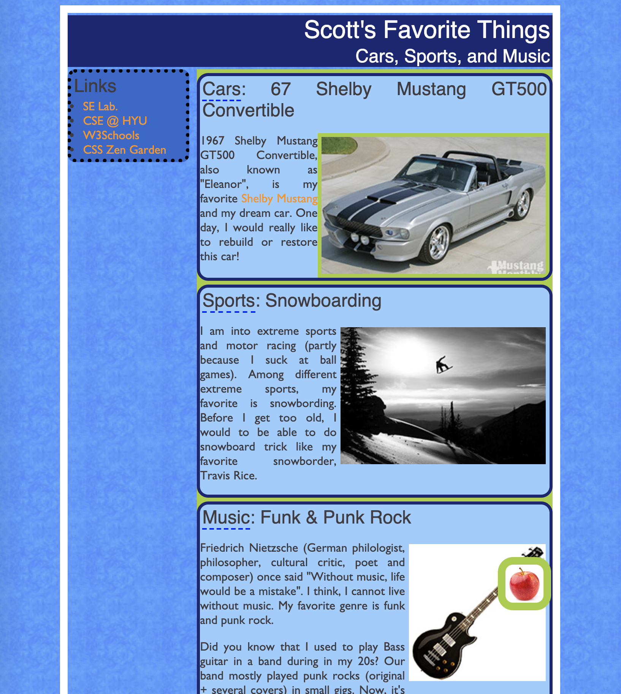

# Styling
## objectives
1. Arrange Your Page into Sections
2. Spacing With Padding and Margins, Backgrounds
3. Float, Alignment and Overflow
4. Cosmetic Finishing Touches
5. 2nd Column, Related Links
6. Green Highlights
7. Semantically Meaningful Tags


## Motivation

1. 각각의 스타일
2. 그룹의 스타일
3. 텍스트 스타일
4. 복잡한 레이아웃


## id

- Unique
- 그 위치로 이동가능 (#id)
- CSS selector: tag#id

## class

- group, reused
- CSS selector: tag.class

## div

- tag
- a logical section or area of a page
- 기본 스타일 X, 입혀줘야함

## span

- Tag

- Inline section
- 마찬가지로 스타일X, 속성부여 또는 직접 입혀줄 것

## CSS context selector


# Layout

- content
- border: content 주변
- padding: content <-> border 사이의 공간
- margin: border와 다른 Element와의 공간


## border

```CSS
h2 { border: 5px solid red;}
// 4방향의 thickness, style, color 순
h2 {
  border-left: thick dotted #CC0088;
  border-bottom-color: rgb(0, 128, 128);
  border-bottom-style: double;
}
// 방향지정
p {
  border: 3px solid blue;
  border-radius: 12px;
  padding: 0.5em;
}
// 테두리
```

## padding

```css
p { padding: 20px; border: 3px solid black; }
h2 { padding: 0px; background-color: yellow; }
p {
  padding-left: 200px; padding-top: 30px;
  background-color: fuchsia;
}
```

margin도 다 비슷함 대충 찾아보고 하면 됨

## dimension

- width, height
- max-width, ...........min-width

```css
p { width: 350px; background-color: yellow; }
h2 { width: 50%; background-color: aqua; }

p {
  margin-left: auto;
  margin-right: auto;
  width: 750px;
}
// 이러면 중앙에 있겠지
```


## margin collapse


## float

계속떠나니는거 overlapping

```
img.headericon {
  float: left;
}
```


## clear

```css
p { background-color: fuchsia; }
h2 { clear: right; background-color: yellow; }
// clear주면 floating element가 이 element를 overlap할 수 없음
```


float 되는거 상쇄?

### overflow

내용물이 넘치면 어케할지

`hidden` `visible`....

`auto` 주면 float 객체가 못넘어감
clear랑 뭔차이지
## Multi column example


## position


## alignment

`text-align - horizontal`

- Top, middle, bottom, text-top, text-bottom 등?

Block element에서 내부의  텍스트 컨텐츠를 정렬할 때 사용

`vertical-align`

Inline element에서 내부 컨텐츠(element) 정렬할 때 사용


## 사용순서

1. alignment로 해결
2. 안되면 floating
3. 또 안되면 position


# Inline boxes

특징

1. size property (width, height, .. 등은 무시됨) - content에 따라 결정되
2. 마진 상, 하는 무시되지만 좌우는 아님
3. 부모 block의 `text-align` 속성이 수평상의 (horizontal) 위치를 결정함
4. inline box의 `vertical-align`이 자기가 속한 block box상에서 자신의 수직위치를 결정


## display

Box 의 형식을 지정가능;`inline`, `block`, `run-in` -?..

### visibiility

`hidden` -> 보일지말지 

### opacity 

투명도 ㅇ

0.0~1.0

#레이아웃 예제

## 구식


구획의 semantic 정보를 class, id 를 통해서 

## 요즘은 tag자체가

