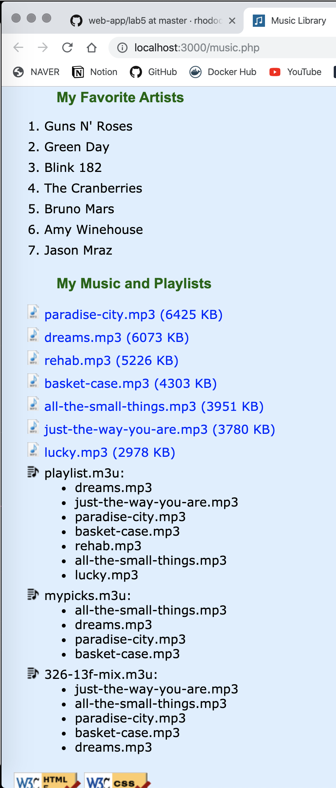

# PHP install

```bash
brew update
brew install php@version(7.3)
brew link php@7.3
(/usr/local 로 symbolic link 를 검)
```

#EX 3 - $_GET

```php+HTML
<?php
					$newspages = 6; // 11 - 5;
					if (isset($_GET["newspages"])) {
						$newspages = 11 - (int) $_GET["newspages"];
						// validate value
						if ($newspages < 0) {
							$newspages = 0;
						}
					}
					for ($news_pages = 11; $news_pages > $newspages; $news_pages--) { ?>
						<li><a href="https://www.billboard.com/archive/article/2019<?=$news_pages?>">2019-<?=$news_pages?></a></li>
				<?php } ?>
```

# glob

```php+HTML
<?php 
				foreach (glob("songs/*.mp3", ) as $mp3) { ?>
					<li class="mp3item">
						<a href=<?= $mp3 ?>><?= basename($mp3) ?> (<?=(int) (filesize($mp3) / 1024)?> KB)</a>
					</li>
				<?php } ?>
```


```php+HTML
<?php
  foreach (glob("songs/*.m3u") as $m3u) { ?>
  <li class="playlistitem"> <?= basename($m3u) ?>:
    <?php foreach (file($m3u, FILE_TEXT) as $line) { ?>
    <ul>
      <?php 
    $pos = stripos($line, "#");
    if ($pos !== 0) { ?>
      <li><?= $line ?> <?= stripos($line, "#") ?></li>
      <?php } ?>
    </ul>
  <?php } ?>

<?php } ?> 
```

# EX 8 - sort & shuffle & strpos

```php+HTML
<?php
				$m3u_array = glob("songs/*.m3u");
				$_ = rsort($m3u_array);
				foreach ($m3u_array as $m3u) { ?>
					<li class="playlistitem"> <?= basename($m3u) ?>:
					
					<?php 
					$items = file($m3u, FILE_TEXT);
					$_ = shuffle($items);
					foreach ($items as $item) { ?>
						<ul>
							<?php 
							$pos = stripos($item, "#");
							if ($pos !== 0) { ?>
								<li><?= $item ?> <?= stripos($item, "#") ?></li>
							<?php } ?>
						</ul>
						
					<?php } ?>
					
				<?php } ?> 
```


# EX 9 - usort (sort by function) & function

https://www.php.net/manual/en/function.usort.php

```php+HTML
<?php
				function _sort_fn($a, $b) {
					$size_a = filesize($a);
					$size_b = filesize($b);

					return ($size_a < $size_b) ? 1 : -1;
				}
				$songs = glob("songs/*.mp3");
				$_ = usort($songs, "_sort_fn");
				foreach ($songs as $mp3) { ?>
					<li class="mp3item">
						<a href=<?= $mp3 ?>><?= basename($mp3) ?> (<?=(int) (filesize($mp3) / 1024)?> KB)</a>
					</li>
				<?php } ?>
```

